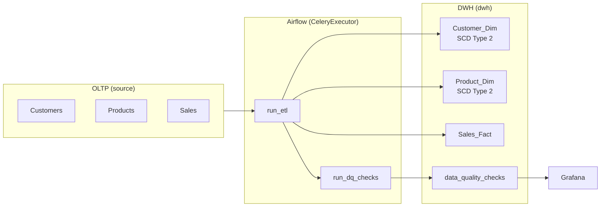

## ETL Pipeline: Учётные системы → Хранилище данных

ETL-пайплайн на Airflow: перенос данных из OLTP-источника в DWH с проверками качества данных.

### Архитектура



### Инструменты

- Docker + docker-compose
- PostgreSQL 18
- Airflow 2.10.5 (CeleryExecutor + Redis)
- Python 3.13, uv
- Grafana (мониторинг качества данных)

### Быстрый старт

1. Клонировать репозиторий:

   ```bash
   git clone ...
   cd etl_cicd
   ```

2. Создать `.env`:

   ```bash
   cp .env.example .env
   ```

3. Проверить `AIRFLOW_UID` (Linux — должен совпадать с `id -u`):

   ```bash
   echo "AIRFLOW_UID=$(id -u)" >> .env
   ```

4. Запустить окружение:

   ```bash
   make airflow-up
   ```

При первом запуске автоматически создаются схемы и загружаются тестовые данные:
5 клиентов, 5 продуктов, 8 продаж.

### Мониторинг

| Сервис | URL | Логин / пароль |
|--------|-----|----------------|
| Airflow UI | http://localhost:8080 | `airflow` / `airflow` |
| Grafana | http://localhost:3000 | `admin` / `admin` |

**Запуск DAG:**
1. Открыть Airflow UI → DAGs
2. Активировать и запустить:
   - `etl_dwh_prod` — продуктовое окружение
   - `etl_dwh_test` — тестовое окружение

Каждый DAG выполняет два шага: `run_etl → run_dq_checks`.

**Grafana — дашборд ETL Data Quality:**
- **Data Freshness** — график количества часов с момента последней загрузки (порог: 24 ч)
- **Latest Check Status** — таблица последних результатов проверок (зелёный — OK, красный — FAIL)

### Схема данных

```
source.Customers  ──┐
source.Products   ──┼──► ETL ──► dwh.Customer_Dim (SCD2)
source.Sales      ──┘            dwh.Product_Dim  (SCD2)
                                 dwh.Sales_Fact
                                 dwh.data_quality_checks
```

Подробное описание полей: [docs/data_dictionary.md](docs/data_dictionary.md)

### Тестовое окружение

Тесты работают одновременно с запущенным Airflow (отдельный контейнер на порту 5433):

```bash
make test-up   # поднять тестовую БД
make test      # прогнать pytest
make test-down # остановить
```

### Проверка данных в БД

```bash
make psql-test   # подключиться к тестовой БД
make psql-prod   # подключиться к продуктовой БД
```

### Структура проекта

```
airflow/
  dags/etl_dag.py          # DAG: run_etl → run_dq_checks
  Dockerfile
docs/
  data_dictionary.md       # описание полей DWH-таблиц
entrypoints/
  db/                      # SQL-скрипты создания схем
  seed/seed.sql            # тестовые данные
grafana/
  provisioning/            # автоматическая настройка datasource и дашборда
  dashboards/
src/
  sql_scripts/olap/        # ETL и DQ-логика
  sql_scripts/oltp.py      # хелперы для работы с источником
tests/                     # pytest
```

### Траблшутинг

**Контейнер не запускается**
```bash
docker compose -f docker-compose.airflow.yaml logs
```

**DAG не отображается в UI**
```bash
make check-dags
```

**Пересоздать окружение с нуля** (сбросить все данные)
```bash
make airflow-down
make airflow-up
```
